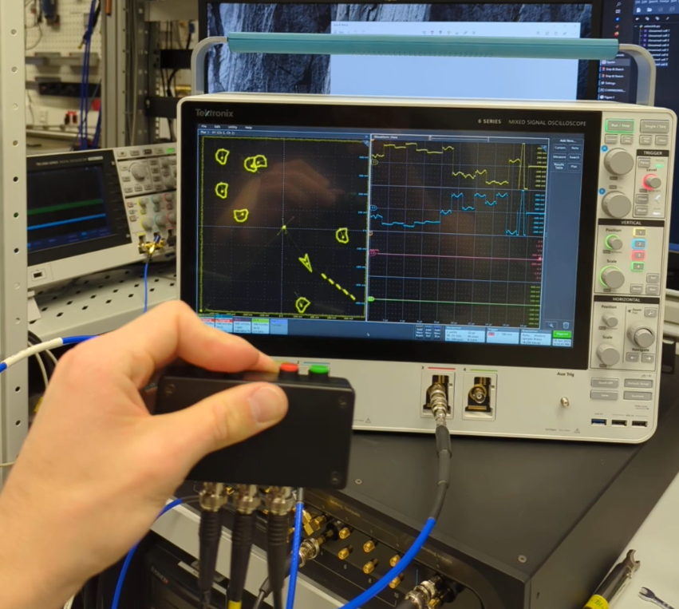

# Asteroids for the Quantum Machine OPX

Demonstrating the real time capabilities of the [QM OPX](https://www.quantum-machines.co/products/opx/) by implementing and playing [Asteroids](https://de.wikipedia.org/wiki/Asteroids) on its FPGA.



## A Closer Look

The [qua](https://docs.quantum-machines.co/0.1/qm-qua-sdk/docs/API_references/qua/dsl_main/) API allows for programming the OPX's FPGA compatibly easy and with very little overhead within python. So the challenge of building Asteroids on the OPX can be boiled down the the following problems:
- How does one output rotated and offset pulses?
- How does one write the game logic to run on the FPGA?
- How does one obtain some user input?

### Drawing Images

To draw 2D images, the [I/Q output](https://docs.quantum-machines.co/0.1/qm-qua-sdk/docs/Introduction/qua_overview/?h=amp#mixed-inputs-element) of the OPX is used to not feed a I/Q modulator (e.g. [QM's Octave](https://www.quantum-machines.co/products/octave/)) but to directly feed into two inputs of an Oscilloscope, which then plots these two channels in some XY Display. (he `'lo_frequency'` is set to 0Hz.)
Using the I/Q output of the OPX allows for the usage of the [`amp()`](https://docs.quantum-machines.co/0.1/qm-qua-sdk/docs/API_references/qua/dsl_main/?h=amp#qm.qua._dsl.amp) function, which allows to mix the I and Q outputs using variables:
``` python
play('pulse_name' * amp(v_00, v_01, v_10, v_11), 'element')
```
We can then choose the `v_*` values to describe the rotation in that plain by the angle `a`:
``` python
def get_rot_amp(a):
    return amp(
		Math.cos2pi(a), -Math.sin2pi(a), 
    	Math.sin2pi(a), Math.cos2pi(a)
    	)
```

The position of the sprite is set by changing the DC offset of the channels:
``` python
def move_cursor(x, y):
    # go to the (x, y) position
    set_dc_offset("screen", "I", x)
    set_dc_offset("screen", "Q", y)
```

The sprites themselves are provided to the OPX within the configuration dict in the form of numpy arrays.

### Movements

Qua provides a [Math api](https://docs.quantum-machines.co/0.1/qm-qua-sdk/docs/API_references/qua/math/) that contains an impressive collection of Math functions that can be executed on the FPGA. And with [`assign()`](https://docs.quantum-machines.co/0.1/qm-qua-sdk/docs/API_references/qua/dsl_main/#qm.qua._dsl.assign) one can realize various calculations. 
For the Asteroids demo, the position, angle, and velocity of the ship are stored as [`fixed`](https://docs.quantum-machines.co/0.1/qm-qua-sdk/docs/Guides/demod/?h=fixed#fixed-point-format) variables on the FPGA. They are then changed by
``` python
assign(ship_x, ship_x+ship_vx*dt)
assign(ship_y, ship_y+ship_vy*dt)
assign(ship_vx, ship_vx+Math.cos2pi(ship_a)*ui_forward*ship_acceleration*dt)
assign(ship_vy, ship_vy+Math.sin2pi(ship_a)*ui_forward*ship_acceleration*dt)
clip_velocity(ship_vy)
clip_velocity(ship_vx)
```
Where `dt` is the time step that is to be realized in this frame, `ui_forward` is a [`fixed`](https://docs.quantum-machines.co/0.1/qm-qua-sdk/docs/Guides/demod/?h=fixed#fixed-point-format) variable that is filled with `{-1, 1}` based on the users input, and `ship_acceleration` is a python variable containing the acceleration that the ship should have. `clip_velocity` is a function that clips each component of the ship's velocity to some maximal velocity. The other variables are all variables on the FPGA.

For the asteroids' and rays' are moved slightly differently. In the case for the asteroids':
``` python
# move asteroids
with for_(j, 0, j<N_asteroids, j+1):
    with if_(asteroids_active[j]):
        assign(asteroids_x[j], asteroids_x[j]+Math.cos2pi(asteroids_a[j])*v_asteroid*dt)
        assign(asteroids_y[j], asteroids_y[j]+Math.sin2pi(asteroids_a[j])*v_asteroid*dt)
```

### Collisions

Collisions between rays and asteroids are calculated by
``` python
def get_distance(ax, ay, bx, by):
    distance = declare(fixed)
    distance = Math.sqrt((ax-bx)*(ax-bx)+(ay-by)*(ay-by))
    return distance

def ray_hit(ray_x, ray_y, asteroid_x, asteroid_y):
    hit = declare(bool, False)
    distance = get_distance(ray_x, ray_y, asteroid_x, asteroid_y)
    with if_(distance < R_asteroid):
        assign(hit, True)
    return hit
```
Note that the distance is not calculated using the provided [`qm.qua.lib.Math.pow`](https://docs.quantum-machines.co/0.1/qm-qua-sdk/docs/API_references/qua/math/?h=pow#qm.qua.lib.Math.pow) function, as it is not defined for negative inputs for the basis. The `pow` function does not throw an error when tasked to process inputs outside of its defined input rages, but outputs some value and the qua program continues with that incorrect result. To work around this, the square is calculated by multiplying the value with itself. (The here used code has not been optimized or bench marked. I would be interesting to know if saving the result of the subtraction is faster then calculating it twice.)

To process the collisions with the border, the position of the ship, rays, and asteroids are clipped using a function like this one:
```python
def cycle_clip(x, upper, lower):
    with if_(x > upper):
        assign(x, lower)
    with elif_(x < lower):
        assign(x, upper)
    return x

def clip(x, upper, lower):
    with if_(x > upper):
        assign(x, upper)
    with elif_(x < lower):
        assign(x, lower)
    return x

def process_border_collisions(x, y):
    for e in [x, y]:
        cycle_clip(e, field_size, -field_size)
    return x, y

def clip_angle(a):
    return cycle_clip(a, .5, -.5)
    
def clip_velocity(v):
    return clip(v, max_speed, -max_speed)
```

### User Input

To play around with the [measurement functionality](https://docs.quantum-machines.co/0.1/qm-qua-sdk/docs/Guides/features/?h=measure#measure-statement-features) of the OPX, a basic user input to the Asteroids game was investigated. The Implementation **is just meeting the goal** of playing Asteroids on the OPX. For example, the contrast of the readout is (for the positive side of the controller) not stable: The contrast between a not pressed and pressed button on the positive side of the controller is very small. And the levels also drift around, such that one had to reconfigure the thresholds in the order of ~0.002 (for the positive side) (A method to plot these values and measure that drift is can be commented in). 

There are currently a few unanswered questions that are related to this problem:
- When measuring for longer duration: Do overflows occur? Can one break the long window into smaller ones?
- How does the common mode voltage on the inputs influence the readout? Would an 1:1 operational amplifier before the OPX as an additional layer of safety also help increase the readout contrast?
- Can one optimize the circuit? Does a different choice for the resistors increase the readout contrast? Would a low pass just before the OPX smooth increase the stability of the readout method?
- Does the tested circuit apply unnecessary stress to the OPX? Is this setup capable of running for longer times?

To readout 4 buttons with two input, the following design is tested:
The 4 buttons are grouped into 2 groups, where diodes are used to probe ether side based on the polarity of the readout signal.
Each button is then connected to a voltage divider that and bridges the R1 resistor with the R2 resistor, and thus changes, based on the choice of the resistors, the voltage at the center of the circuit, which is connected to one of the OPX inputs. Further considerations might be the usage of an low pass or an resistor directly before the OPX inputs.
(This idea comes form a person with very little electronics experience.)  


The choice of the resistor was chosen as follows:

| Resistor | Tested Resistance | 
|----------|-------------------|
| R1 	   | 	  125kOhm 	   |
| R2 	   |    1kOhm & 0Ohm   |
| R3 	   | 	  125kOhm 	   |

To increase the contrast, the resistor R2 was bridged, where as removing R1 might have been a better approach.


## Problems

### Overflows 
As variables can overflow without notifying the user, funky things can happen. One of these things is the burst of rays, that the spaceship fires after some time. 

### Math Functions 
Some math functions are only defined for inputs in certain ranges. If they are given values outside of these ranges, the Math functions will still try to compute something, but the results can then easily be (very) wrong. The one writing the programs has to keep this in mind.

### Flaky Controller
The controller is good enough to have some fun in the lab, but might need to be refined when using more intensively. One could refine the here investigated circuit, or choose some other concepts to sense some user input:
- Buttons that link each one digital output to some input. I.e. 4 digital outputs going to 4 buttons (one for each output) and than all these buttons might be connected to one of the opx's inputs. Then probing each button one by one by applying a voltage to the corresponding digital output
- Piezoelectric sensors that are amplified by some transistor feed by some analog input. This might be an interesting case to demo lock-in measurements. 
- Photoresistor that are covered by the users finger. Then Some algorithm to track the resistivity for a pressed and one for a not pressed button might be required to changes in the environments lighting.


## Other Findings

The purpose of this project was to get to know the OPX and to help the decision of buying these devices.
In this process, further insights were noted down. They can be treated as a lab notebook.

---

Errors in a qua program that are re are not linked to assigning values to variables that are not of the correct type (in the `declare` statement), the error message does not contain a line number or variable name. E.g. when trying to cast a python number (to a string) to an incorrect qua variable.

---

The names of the outputs have to ether be `"single"` or `"I", "Q"`. 

---

Statements that mix types incorrectly, e.g.
``` python
with if_(False & get_distance(...) < -100):
```
result in errors like these
```
... - qm - ERROR    - Unexpected error: Failed to compile job
... - qm - ERROR    - Internal error. Please report it to QM (ts=1676305299758)
... - qm - ERROR    - Job 1675865789342 failed. Failed to execute program.
...
FailedToAddJobToQueueException: Job 1675865789342 failed. Failed to execute program.
```
The following order is correct and works:
``` python
with if_(get_distance(...) < -100 & False):
```

---

When modulating pulses with some `lo_frequency` and reaching the bounds of the outputs range, the effect of the modulation might be different than when not close to the bounds.

---
